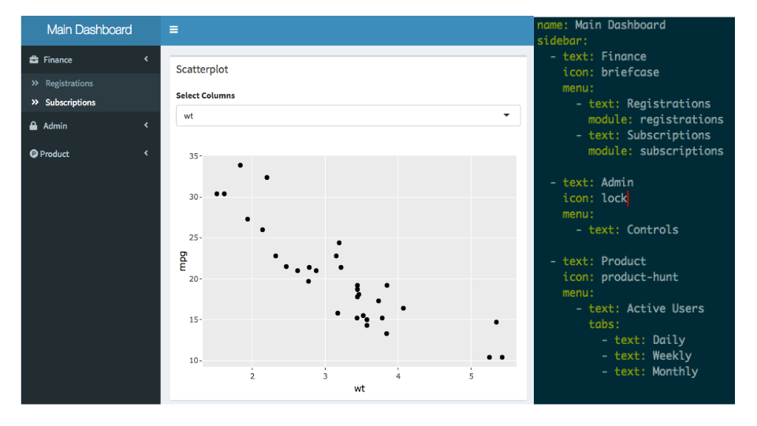

# ShinyBones 

 [](https://www.tidyverse.org/lifecycle/#experimental)


__shinybones__ is an R package :skull_and_crossbones: that provides a highly opinionated way to organize large, multi-page shiny apps. It allows users to focus on building independent modules for each page following a minimal set of conventions, and relegating all the boilerplate code involding in laying them out in the dashboard to a simple YAML configuration file.



## Installation

You can install `shinybones` from github:

```r
remotes::install_github('ramnathv/shinybones')
```

`shinybones` ships with two useful snippets `stpage` and `stcomponent` that lets you create `page` and `component` modules that follow the conventions. You can install it by running `st_add_snippets`. Note that you will need to restart RStudio for the snippets to be usable.

```r
shinybones::sb_add_snippets()
```

## Usage

You can easily scaffold a shinydashboard app using `shinybones` by clicking on the `New Project` menu in `RStudio`


## Conventions

1. A module referred to as `foo` needs to specify the following functions:

   - ui: `foo_ui`
   - server: `foo`
   - sidebar: `foo_ui_sidebar` (optional)
   
<br/>

2. The layout for the dashboard is specified in YAML.

   - Each `menu` item becomes a menu item in the sidebar.
   - If a `menu` item has more than 1 child, the children become subitems.
   - If the child of a `menu` item has a `tabs` item, they are rendered as a
     `tabSetPanel`
   - Each item (page) is connected to a module by its name.
   

```yaml
name: Main Dashboard
sidebar:
  - text: Finance
    icon: briefcase
    menu:
      - text: Registrations
        module: registrations
      - text: Subscriptions
        tabs:
          - text: Individual
            module: subscribers_individual
          - text: Group
            module: subscribers_group

  - text: People
    icon: user
    menu:
      - text: People
        tabs:
          - text: Team Size
            module: team_size
          - text: Organogram
            module: organogram
```

## Development Process

1. Each page is independently developed as a standalone module.
2. Use the function `preview_module` to preview the module.
3. Add it to the dashboard by editing `_site.yml`.


## ToDos

- [x] Hook up passing of data to each module
- [x] Wrap all utilities into a package
- [ ] Automatically check if tabnames are unique
- [x] Allow factory modules that can accept static parameters
- [ ] Fix bugs where when menu item has only one child, tabNames have to be same.
- [ ] Allow deep linking at the tab level (by default)

## Acknowledgements

This package was initially named `satin`, but had to be renamed since it was already in use by a now-archived package on CRAN. Thanks to @dgrtwo for suggesting the name `shinybones`, which is very appropriate since this package allows you to create a skeleton of a dashboard app!

<style>
img.center {
  display: block;
  margin-left: auto;
  margin-right: auto;
}
</style>
